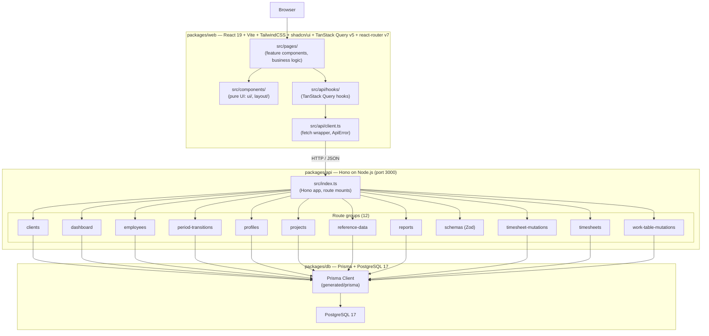
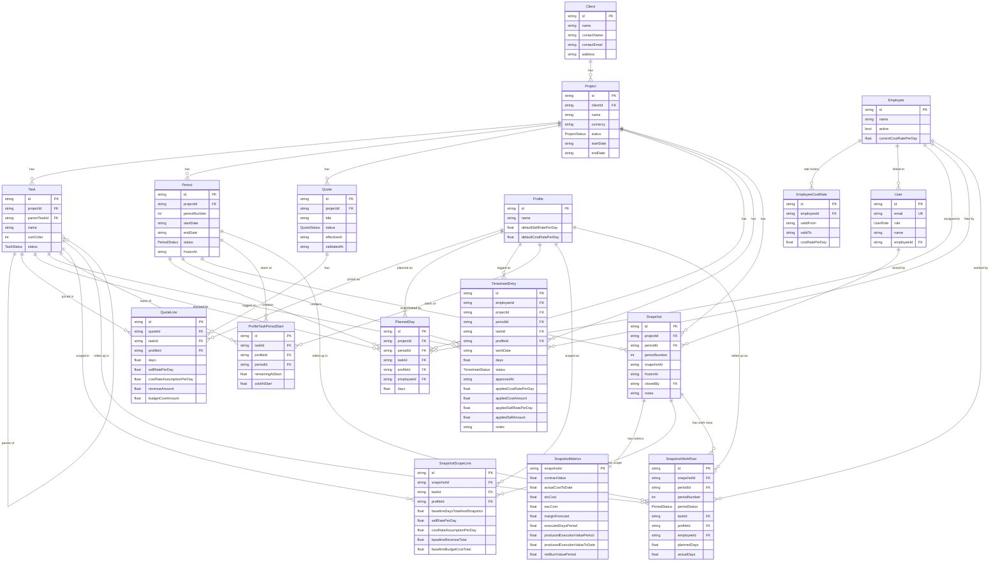

# BigDil Architecture

This document describes the high-level architecture of the BigDil monorepo, the
data model that backs it, and the core domain lifecycles that the application
orchestrates.

## Application Architecture

BigDil is a pnpm-workspace monorepo with three packages: `web`, `api`, and
`db`. The frontend is a single-page React app that talks to a Hono API over
HTTP, which in turn persists state in PostgreSQL through the Prisma ORM.

### Frontend layering rules

- `src/components/` is **pure UI only** — no domain types, no fetching,
  reusable in any feature. This includes `components/ui/` (shadcn primitives)
  and `components/layout/` (the app shell).
- `src/pages/` owns **all business-specific code**: feature components,
  domain models, page-level orchestration, and data-fetching wiring.
- `src/api/hooks/` exposes TanStack Query hooks; UI never calls `fetch`
  directly — it goes through `src/api/client.ts`, which throws a typed
  `ApiError` on non-2xx responses.

### API surface

The Hono app composes 12 route groups. `schemas.ts` is a shared Zod module
used by mutation routes for request validation; the others mount under
`/api/<group>` and are responsible for both query and mutation endpoints
related to their domain.

## Data Model

The schema lives in `packages/db/prisma/schema.prisma`. It models clients,
projects with hierarchical tasks, profile-based pricing, weekly periods,
quotes with quote lines, planning (`PlannedDay`) and execution
(`TimesheetEntry`) data, and end-of-period snapshots that freeze the
project's financial picture.

### Enums

- **`UserRole`**: `ADMIN`, `PM`, `CONSULTANT`, `FINANCE`, `EXEC`.
- **`ProjectStatus`**: `DRAFT`, `WAITING_APPROVAL`, `TO_PLAN`, `PLANNING`,
  `IN_PROGRESS`, `COMPLETED`.
- **`PeriodStatus`**: `FUTURE`, `OPEN`, `CONSOLIDATION`, `FROZEN`.
- **`QuoteStatus`**: `DRAFT`, `SENT`, `VALIDATED`, `REJECTED`.
- **`TaskStatus`**: `planned`, `active`, `done`.
- **`TimesheetStatus`**: `DRAFT`, `SUBMITTED`, `APPROVED`, `REJECTED`.

## Key Domain Concepts

### Period lifecycle: `FUTURE → OPEN → CONSOLIDATION → FROZEN`

A `Project` is split into weekly `Period` rows generated by
`buildWeeklyPeriods` when the project transitions from `TO_PLAN` to
`PLANNING` (or directly to `IN_PROGRESS`). Each period walks through four
states, all gated by the period-transition routes:

1. **`FUTURE`** (default at creation) — planning is allowed; no time can be
   logged yet. The first `FUTURE` period is automatically promoted to `OPEN`
   when the project reaches `IN_PROGRESS`.
2. **`OPEN`** — the active production week. Consultants log
   `TimesheetEntry` rows against this period. Only one period per project
   may be `OPEN` at a time; `POST /api/projects/:id/periods/:pid/open`
   enforces this invariant.
3. **`CONSOLIDATION`** — entered via
   `POST /api/projects/:id/periods/:pid/start-consolidation`. The period is
   no longer accepting new work; PMs are reviewing and approving submitted
   timesheets. Cells displayed in the work-table fall back to actuals from
   approved timesheets for `CONSOLIDATION` and `FROZEN` periods.
4. **`FROZEN`** — entered via `POST /api/projects/:id/periods/:pid/freeze`.
   The freeze endpoint refuses to run while any timesheet for the period is
   not `APPROVED`. On success it (a) computes a full `Snapshot` plus its
   `SnapshotMetrics` (contract value, actual cost-to-date, ETC, EAC, margin
   forecast, produced execution value, net burn), (b) flips the period to
   `FROZEN` with a `frozenAt` date, and (c) seeds
   `ProfileTaskPeriodStart` rows for the next period so the planner knows
   the remaining and sold days at the start of the next week.

> **Note on terminology.** `CONSOLIDATION` is sometimes referred to as
> "PRODUCTION" in older planning notes; the canonical name in the schema and
> API is `CONSOLIDATION`.

### Timesheet lifecycle: `DRAFT → SUBMITTED → APPROVED / REJECTED`

`TimesheetEntry` rows track time logged by an employee against a
`(project, period, task, profile)` quadruple. They progress through:

1. **`DRAFT`** — created via `POST /api/timesheets`. The author can keep
   editing `days` and `notes` (`PATCH /api/timesheets/:id`) until they
   submit.
2. **`SUBMITTED`** — `POST /api/timesheets/:id/submit`. The entry enters the
   PM approval queue surfaced by `GET /api/timesheets/approvals`.
3. **`APPROVED`** — `POST /api/timesheets/:id/approve`. Approval freezes
   rates (see below), stamps `approvedAt`, and is required before the
   parent period can be frozen.
4. **`REJECTED`** — `POST /api/timesheets/:id/reject`. Rejected entries are
   editable again and can be re-submitted.

A timesheet entry can only be edited while in `DRAFT` or `REJECTED`, and can
only be approved from `SUBMITTED`. These guards are enforced inside each
mutation route.

### Rate freezing on approval

Cost and sell rates are intentionally not stored on the timesheet at draft
time — they are *captured* only when the entry is approved, so historical
financials never drift if rates later change. Approval pulls from two
sources in a single Prisma transaction
(`packages/api/src/routes/timesheet-mutations.ts`):

- **Cost rate** comes from `EmployeeCostRate`: the most recent rate row for
  the employee whose `validFrom` is on or before the entry's `workDate`.
  This is written to `applied_cost_rate_per_day`; the cost amount is
  `days * costRate`, written to `applied_cost_amount`.
- **Sell rate** comes from `QuoteLine`: the line on a `VALIDATED` quote of
  the same project that matches the entry's `(taskId, profileId)`. This is
  written to `applied_sell_rate_per_day`; the sell amount is
  `days * sellRate`, written to `applied_sell_amount`.

Once frozen on the entry, these values flow into the period freeze
calculation: actual cost-to-date sums `applied_cost_amount`, produced
execution value sums `applied_sell_amount`, and the resulting margin
forecast (`contractValue − eacCost`) is persisted in `SnapshotMetrics` for
the period. This is what gives BigDil an immutable, auditable financial
trail per project.
