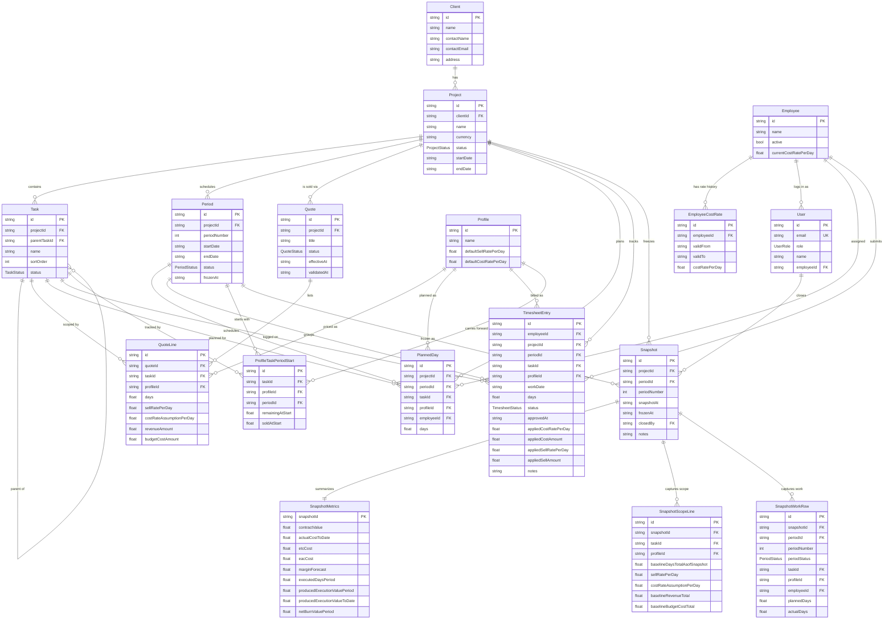

# Data Model Reference

bigdil is a project management and financial tracking platform for consulting firms. It models the full lifecycle of a client engagement — from quote and scope through weekly planning, timesheets, period freezing, and immutable financial reporting.

## Overview

The domain centers on **projects** delivered by **employees** (matched to billable **profiles**) for **clients** under one or more **quotes**. Work is organized into hierarchical **tasks** and time-boxed **periods** (typically weekly). Each period carries planned days and timesheet entries that, once approved, capture the cost and sell rates that applied at the time. Periods move through a lifecycle (FUTURE → OPEN → CONSOLIDATION → FROZEN) and produce **snapshots** — immutable records of the financial position and work breakdown at the moment of freezing.

## Enums

### UserRole

| Value | Meaning |
|-------|---------|
| `ADMIN` | Full administrative access — manages users, settings, and master data. |
| `PM` | Project Manager — owns project planning, freezes periods, approves timesheets. |
| `CONSULTANT` | Delivery staff — submits timesheets against assigned tasks. |
| `FINANCE` | Read-only access to financial metrics and snapshots for reporting. |
| `EXEC` | Executive read-only view across the firm's portfolio. |

### ProjectStatus

| Value | Meaning |
|-------|---------|
| `DRAFT` | Project is being scoped internally; not yet shared with the client. |
| `WAITING_APPROVAL` | Quote sent and awaiting client validation. |
| `TO_PLAN` | Quote validated; project not yet scheduled into periods. |
| `PLANNING` | Schedule is being built (periods created, planned days assigned). |
| `IN_PROGRESS` | Active delivery — at least one period is OPEN or in CONSOLIDATION. |
| `COMPLETED` | All periods frozen, project closed. |

### PeriodStatus

| Value | Meaning |
|-------|---------|
| `FUTURE` | Period sits ahead of the active period; planning may exist but no time is logged. |
| `OPEN` | Period is currently active; consultants log time into it. |
| `CONSOLIDATION` | Period has ended; PM is reviewing/approving timesheets before freezing. |
| `FROZEN` | Period is closed and immutable; a Snapshot has been created. |

### QuoteStatus

| Value | Meaning |
|-------|---------|
| `DRAFT` | Internal draft, not yet sent to the client. |
| `SENT` | Sent to the client and awaiting response. |
| `VALIDATED` | Client has accepted the quote — its lines feed the project baseline. |
| `REJECTED` | Client declined the quote. |

### TaskStatus

| Value | Meaning |
|-------|---------|
| `planned` | Work has not yet started on this task. |
| `active` | Work is in flight on this task. |
| `done` | Work is complete on this task. |

### TimesheetStatus

| Value | Meaning |
|-------|---------|
| `DRAFT` | Consultant is still editing the entry; not yet submitted. |
| `SUBMITTED` | Consultant has submitted; PM review pending. |
| `APPROVED` | PM has approved; cost+sell rates are frozen onto the entry. |
| `REJECTED` | PM rejected the entry; consultant must amend and resubmit. |

## Models

### Client

A customer organization that contracts the firm to deliver one or more projects.

| Field | Type | Description |
|-------|------|-------------|
| `id` | `string` | Primary key. |
| `name` | `string` | Legal or trading name of the client (e.g. "TechVision SA"). |
| `contactName` | `string` | Primary point-of-contact at the client. |
| `contactEmail` | `string` | Email address of the primary contact. |
| `address` | `string` | Postal address of the client. |

Relationships:
- Has many **Project**

### User

An application user (consultant, PM, finance, exec, or admin). May or may not be linked to an Employee record (admin/finance/exec users typically are not).

| Field | Type | Description |
|-------|------|-------------|
| `id` | `string` | Primary key. |
| `email` | `string` | Unique login email. |
| `role` | `UserRole` | Authorization role driving feature access. |
| `name` | `string` | Display name. |
| `employeeId` | `string?` | Optional link to the Employee record this user logs time as. |

Relationships:
- Optionally belongs to **Employee** (when the user is a consultant)
- Has many **Snapshot** (as the period closer, via `closedBy`)

### Profile

A billable role/seniority category (e.g. "Senior Consultant", "Project Manager"). Profiles carry the default rates used when scoping a quote line and act as the unit of pricing — work is sold and tracked at the (task, profile) level, regardless of which employee actually performs it.

| Field | Type | Description |
|-------|------|-------------|
| `id` | `string` | Primary key. |
| `name` | `string` | Profile label shown in the UI (e.g. "Technical Architect"). |
| `defaultSellRatePerDay` | `float` | Default rate billed to the client for one day of this profile, in EUR/day. Pre-fills new quote lines. |
| `defaultCostRatePerDay` | `float` | Default internal cost assumption for one day of this profile, in EUR/day. Used as the cost assumption when scoping. |

Relationships:
- Has many **QuoteLine**, **PlannedDay**, **TimesheetEntry**, **ProfileTaskPeriodStart**
- Has many **SnapshotScopeLine**, **SnapshotWorkRow**

### Employee

A staff member who performs billable work. An employee's cost rate evolves over time via `EmployeeCostRate` history, while `currentCostRatePerDay` caches the rate in effect today for fast UI access.

| Field | Type | Description |
|-------|------|-------------|
| `id` | `string` | Primary key. |
| `name` | `string` | Employee display name. |
| `active` | `boolean` | Whether the employee is currently with the firm; inactive employees are hidden from new assignments but kept for historical timesheets. Defaults to `true`. |
| `currentCostRatePerDay` | `float` | Current cost rate in EUR/day, used for fast lookups; should mirror the active row in `EmployeeCostRate`. |

Relationships:
- Has many **EmployeeCostRate** (rate history)
- Has many **User** (typically zero or one user account per employee)
- Has many **PlannedDay**, **TimesheetEntry**, **SnapshotWorkRow**

### EmployeeCostRate

A time-bounded cost rate for one employee. Multiple rows track salary changes over time. The row with `validTo = null` is the currently-effective rate.

| Field | Type | Description |
|-------|------|-------------|
| `id` | `string` | Primary key. |
| `employeeId` | `string` | Owning employee. |
| `validFrom` | `string` | ISO date this rate became effective (inclusive). |
| `validTo` | `string?` | ISO date this rate stopped applying (inclusive); `null` means the rate is still effective. |
| `costRatePerDay` | `float` | Internal cost in EUR/day for the employee during this validity window. |

Relationships:
- Belongs to **Employee**

### Project

A client engagement with a defined scope, schedule, and budget. Projects own their tasks, periods, and quotes.

| Field | Type | Description |
|-------|------|-------------|
| `id` | `string` | Primary key. |
| `clientId` | `string` | Client this project is delivered for. |
| `name` | `string` | Project name (e.g. "ERP Migration"). |
| `currency` | `string` | ISO 4217 currency code; defaults to `EUR`. |
| `status` | `ProjectStatus` | Lifecycle status of the project. |
| `startDate` | `string?` | Planned project start (ISO date); `null` until scheduled. |
| `endDate` | `string?` | Planned project end (ISO date); `null` until scheduled. |

Relationships:
- Belongs to **Client**
- Has many **Task**, **Period**, **Quote**, **PlannedDay**, **TimesheetEntry**, **Snapshot**

### Task

A unit of work within a project, optionally nested under a parent task to form a phase/sub-task hierarchy.

| Field | Type | Description |
|-------|------|-------------|
| `id` | `string` | Primary key. |
| `projectId` | `string` | Owning project. |
| `parentTaskId` | `string?` | Parent task, or `null` for a top-level task (typically a phase). |
| `name` | `string` | Task title (e.g. "Phase 2 — Design", "Solution Architecture"). |
| `sortOrder` | `int` | Display order among sibling tasks. |
| `status` | `TaskStatus` | Whether the task is `planned`, `active`, or `done`. |

Relationships:
- Belongs to **Project**
- Belongs to **Task** (parent), has many **Task** (children)
- Has many **QuoteLine**, **PlannedDay**, **TimesheetEntry**, **ProfileTaskPeriodStart**
- Has many **SnapshotScopeLine**, **SnapshotWorkRow**

### Period

A reporting window (typically one week) within a project. Periods are the unit of operational rhythm: planning, timesheet collection, consolidation, and freezing all happen at the period level.

| Field | Type | Description |
|-------|------|-------------|
| `id` | `string` | Primary key. |
| `projectId` | `string` | Owning project. |
| `periodNumber` | `int` | 1-based sequence number within the project (1 = first week). |
| `startDate` | `string` | First calendar day of the period (ISO date). |
| `endDate` | `string` | Last calendar day of the period (ISO date). |
| `status` | `PeriodStatus` | Lifecycle stage; defaults to `FUTURE`. |
| `frozenAt` | `string?` | ISO date the period was frozen; `null` until it reaches `FROZEN`. |

Relationships:
- Belongs to **Project**
- Has many **PlannedDay**, **TimesheetEntry**, **ProfileTaskPeriodStart**, **Snapshot**, **SnapshotWorkRow**

### Quote

A commercial proposal attached to a project. A project may have multiple quotes — typically one initial scope plus change orders. Validated quotes contribute to the project's contracted scope.

| Field | Type | Description |
|-------|------|-------------|
| `id` | `string` | Primary key. |
| `projectId` | `string` | Owning project. |
| `title` | `string` | Human-readable quote name (e.g. "Initial Scope — ERP Migration", "Change Order #1"). |
| `status` | `QuoteStatus` | Lifecycle of the quote. |
| `effectiveAt` | `string?` | ISO date the quote becomes effective (typically when the work it covers may start). |
| `validatedAt` | `string?` | ISO date the client validated the quote. |

Relationships:
- Belongs to **Project**
- Has many **QuoteLine**

### QuoteLine

A single (task × profile) sale line on a quote: how many days of which profile are sold against which task, with the rates and amounts agreed at quoting time.

| Field | Type | Description |
|-------|------|-------------|
| `id` | `string` | Primary key. |
| `quoteId` | `string` | Owning quote. |
| `taskId` | `string` | Task this line scopes. |
| `profileId` | `string` | Profile being sold. |
| `days` | `float` | Number of days sold for this (task, profile). |
| `sellRatePerDay` | `float` | Rate billed to the client for this line, in EUR/day. |
| `costRateAssumptionPerDay` | `float` | Internal cost assumption used to compute the budget for this line, in EUR/day. |
| `revenueAmount` | `float` | Total revenue for the line: `days × sellRatePerDay`. |
| `budgetCostAmount` | `float` | Total budgeted cost for the line: `days × costRateAssumptionPerDay`. |

Relationships:
- Belongs to **Quote**, **Task**, **Profile**

### PlannedDay

The number of days planned for a (project, period, task, profile, employee) combination. Drives forecasting and capacity planning. The unique constraint on `(projectId, periodId, taskId, profileId, employeeId)` ensures one planning row per intersection. `employeeId` may be `null` to represent unassigned-but-planned capacity (e.g. PM time pooled at the profile level).

| Field | Type | Description |
|-------|------|-------------|
| `id` | `string` | Primary key. |
| `projectId` | `string` | Owning project. |
| `periodId` | `string` | Period the days are scheduled in. |
| `taskId` | `string` | Task the days are planned against. |
| `profileId` | `string` | Profile the days are planned as. |
| `employeeId` | `string?` | Employee the days are assigned to; `null` for unassigned planned capacity. |
| `days` | `float` | Planned number of days for this row. |

Relationships:
- Belongs to **Project**, **Period**, **Task**, **Profile**
- Optionally belongs to **Employee**

### TimesheetEntry

A logged unit of work by an employee on a (project, period, task, profile) combination on a specific day. Once approved, the entry captures (`appliedCostRatePerDay`, `appliedSellRatePerDay`) and computed amounts so the entry is invariant under future rate changes.

| Field | Type | Description |
|-------|------|-------------|
| `id` | `string` | Primary key. |
| `employeeId` | `string` | Employee who performed the work. |
| `projectId` | `string` | Project the work is charged to. |
| `periodId` | `string` | Period the entry is grouped under. |
| `taskId` | `string` | Task the work is logged against. |
| `profileId` | `string` | Profile the work is billed as. |
| `workDate` | `string` | ISO date the work was performed. |
| `days` | `float` | Number of days worked (e.g. `0.5`, `1`). |
| `status` | `TimesheetStatus` | Approval lifecycle; defaults to `DRAFT`. |
| `approvedAt` | `string?` | ISO date of approval; `null` until approved. |
| `appliedCostRatePerDay` | `float?` | Cost rate frozen onto the entry on approval, in EUR/day. `null` while DRAFT/SUBMITTED. |
| `appliedCostAmount` | `float?` | `days × appliedCostRatePerDay`, captured on approval. |
| `appliedSellRatePerDay` | `float?` | Sell rate frozen onto the entry on approval, in EUR/day. `null` while DRAFT/SUBMITTED. |
| `appliedSellAmount` | `float?` | `days × appliedSellRatePerDay`, captured on approval. |
| `notes` | `string` | Free-text consultant note; defaults to empty string. |

Relationships:
- Belongs to **Employee**, **Project**, **Period**, **Task**, **Profile**

### ProfileTaskPeriodStart

A per-period opening balance that records, at the start of a given period, how many days remain on the (task, profile) scope and how many days have been sold to date. Used to render reliable burn-down charts and "remaining" figures without recomputing across all historical entries each time the UI loads.

| Field | Type | Description |
|-------|------|-------------|
| `id` | `string` | Primary key. |
| `taskId` | `string` | Task whose remaining/sold balance is captured. |
| `profileId` | `string` | Profile dimension of the balance. |
| `periodId` | `string` | Period these opening balances apply to. |
| `remainingAtStart` | `float` | Days remaining on the (task, profile) scope at the start of the period. |
| `soldAtStart` | `float` | Total days sold for the (task, profile) at the start of the period (sum of validated quote-line days as of that point). |

Relationships:
- Belongs to **Task**, **Profile**, **Period**

### Snapshot

An immutable record taken when a period is frozen. Captures the full financial picture and a reduced view of the work breakdown so historical reporting cannot be perturbed by later edits to live planning, rates, or quote lines.

| Field | Type | Description |
|-------|------|-------------|
| `id` | `string` | Primary key. |
| `projectId` | `string` | Project being snapshotted. |
| `periodId` | `string` | Period being closed. |
| `periodNumber` | `int` | Cached period number for stable ordering without a join. |
| `snapshotAt` | `string` | ISO date the snapshot was created. |
| `frozenAt` | `string` | ISO date the underlying period was frozen (typically equal to `snapshotAt`). |
| `closedBy` | `string` | User id of the PM who froze the period. |
| `notes` | `string` | Free-text closing note (e.g. "Period 4 closed — design phase progressing"); defaults to empty string. |

Relationships:
- Belongs to **Project**, **Period**, **User** (`closedByUser`)
- Has one **SnapshotMetrics**
- Has many **SnapshotScopeLine**, **SnapshotWorkRow**

### SnapshotMetrics

The financial KPIs computed at the moment of freeze. One-to-one with `Snapshot`.

| Field | Type | Description |
|-------|------|-------------|
| `snapshotId` | `string` | Primary key and FK to the parent `Snapshot`. |
| `contractValue` | `float` | Sum of validated quote-line revenue as of the freeze (i.e. contracted revenue). |
| `actualCostToDate` | `float` | Cumulative `appliedCostAmount` from approved timesheets up to and including this period. |
| `etcCost` | `float` | Estimate To Complete — projected remaining cost based on planning. |
| `eacCost` | `float` | Estimate At Completion — `actualCostToDate + etcCost`. |
| `marginForecast` | `float` | `contractValue − eacCost`. |
| `executedDaysPeriod` | `float` | Days of approved work logged within this period. |
| `producedExecutionValuePeriod` | `float` | Sell-rate value of the period's executed work, in EUR. |
| `producedExecutionValueToDate` | `float` | Cumulative produced-execution value through this period. |
| `netBurnValuePeriod` | `float` | Net burn (produced execution value net of any adjustments) for the period. |

Relationships:
- Belongs to **Snapshot** (one-to-one)

### SnapshotScopeLine

A frozen view of the (task × profile) scope at the snapshot moment — what was sold, at what rates, and the resulting baseline revenue/cost totals. Lets reports reproduce baseline figures even if quotes are later edited.

| Field | Type | Description |
|-------|------|-------------|
| `id` | `string` | Primary key. |
| `snapshotId` | `string` | Owning snapshot. |
| `taskId` | `string` | Task dimension. |
| `profileId` | `string` | Profile dimension. |
| `baselineDaysTotalAsofSnapshot` | `float` | Total contracted days for the (task, profile) at snapshot time. |
| `sellRatePerDay` | `float` | Sell rate captured for this scope line, in EUR/day. |
| `costRateAssumptionPerDay` | `float` | Cost assumption captured for this scope line, in EUR/day. |
| `baselineRevenueTotal` | `float` | `baselineDaysTotalAsofSnapshot × sellRatePerDay`. |
| `baselineBudgetCostTotal` | `float` | `baselineDaysTotalAsofSnapshot × costRateAssumptionPerDay`. |

Relationships:
- Belongs to **Snapshot**, **Task**, **Profile**

### SnapshotWorkRow

A frozen row of the work table at snapshot time — one row per (period, task, profile, employee) intersection covered by the snapshot. Includes period-level fields (`periodNumber`, `periodStatus`) so the snapshot can render the work table without joining live periods that may later evolve.

| Field | Type | Description |
|-------|------|-------------|
| `id` | `string` | Primary key. |
| `snapshotId` | `string` | Owning snapshot. |
| `periodId` | `string` | Period the row belongs to. |
| `periodNumber` | `int` | Cached period number for ordering. |
| `periodStatus` | `PeriodStatus` | Cached period status as of snapshot time. |
| `taskId` | `string` | Task dimension. |
| `profileId` | `string` | Profile dimension. |
| `employeeId` | `string?` | Employee dimension; `null` for unassigned planning rows. |
| `plannedDays` | `float` | Planned days for the row at snapshot time. |
| `actualDays` | `float?` | Actual days logged for the row; `null` for periods where actuals do not apply. |

Relationships:
- Belongs to **Snapshot**, **Period**, **Task**, **Profile**
- Optionally belongs to **Employee**

## Domain Rules

### Period Lifecycle

Periods progress through four states in order: `FUTURE → OPEN → CONSOLIDATION → FROZEN`. At any moment a project typically has many `FUTURE` periods, one `OPEN` period (the current week), at most one `CONSOLIDATION` period (the just-ended week awaiting closure), and a tail of `FROZEN` periods.

- **FUTURE → OPEN.** When a period's start date is reached, it becomes the active period. Consultants can now create timesheet entries against it. Planning may already exist on `FUTURE` periods, but no time is logged there.
- **OPEN → CONSOLIDATION.** When the period ends, the PM moves it into consolidation. New timesheet entries are typically locked, while submitted entries can still be approved or rejected. The consultant team finalizes any pending submissions.
- **CONSOLIDATION → FROZEN.** The PM freezes the period. The freeze endpoint atomically:
  1. Marks the period `FROZEN` and stamps `frozenAt`.
  2. Creates a `Snapshot` row tied to (project, period) and stamps `closedBy = currentUser`.
  3. Computes and persists `SnapshotMetrics` (contract value, actuals, ETC/EAC, margin, executed days, produced execution value, net burn).
  4. Captures `SnapshotScopeLine` rows from the validated quote lines as of that moment.
  5. Captures `SnapshotWorkRow` rows from planned days and approved timesheets as of that moment.

After freezing, the snapshot is the source of truth for that period — later edits to live data must not change it.

### Timesheet Lifecycle

Timesheet entries follow `DRAFT → SUBMITTED → APPROVED | REJECTED`.

- **DRAFT.** Created and edited by the consultant. No rates are applied yet; `applied*` fields stay `null`.
- **SUBMITTED.** The consultant marks the entry ready for review. The PM (or Admin) sees it in their approval queue.
- **APPROVED.** The PM approves the entry. On approval, `approvedAt` is stamped and **rate freezing** runs (see below). The four `applied*` fields are populated.
- **REJECTED.** The PM rejects the entry; it returns to the consultant for amendment and resubmission. Cost and sell rates are not captured for rejected entries.

Approval is the gating action that locks rates and contributes the entry to the project's actual cost and produced-execution value figures.

### Rate Freezing

When a `TimesheetEntry` is approved, bigdil **freezes the cost and sell rates onto the entry** so historical financials are stable across rate changes:

1. **Cost rate** is read from `EmployeeCostRate` — the row whose `[validFrom, validTo]` range covers the entry's `workDate` (the row with `validTo = null` if the rate is still current). The selected `costRatePerDay` is written to `appliedCostRatePerDay`, and `appliedCostAmount = days × appliedCostRatePerDay`.
2. **Sell rate** is read from the validated `QuoteLine` matching the entry's `(task, profile)` — the rate the client is paying for that combination. The `sellRatePerDay` is written to `appliedSellRatePerDay`, and `appliedSellAmount = days × appliedSellRatePerDay`.

Once captured, these values are immutable. If an employee gets a raise (a new `EmployeeCostRate`) or a change-order updates the sell rate, already-approved entries keep the rates that applied at the time the work was approved. This is the foundation of stable historical reporting.

### Snapshot

A `Snapshot` is the immutable financial record of a project at the moment a period is frozen. It is created inside the freeze endpoint as part of the same transaction that flips the period to `FROZEN`. A snapshot is composed of three parts:

- **`SnapshotMetrics`** — the headline financials (contract value, actual cost, ETC, EAC, margin forecast, executed days, produced execution value period and to-date, net burn). One row per snapshot.
- **`SnapshotScopeLine`** — one row per (task × profile) capturing the contracted scope (days, sell rate, cost assumption, baseline revenue, baseline cost) as of the snapshot.
- **`SnapshotWorkRow`** — one row per (period × task × profile × employee) covered by the snapshot, capturing planned and actual days along with the period's number and status at the time.

Together these tables let the UI reconstruct the entire frozen state of a project — financials, scope, and work breakdown — without depending on live data that may have evolved since. They are the audit trail of the engagement.
